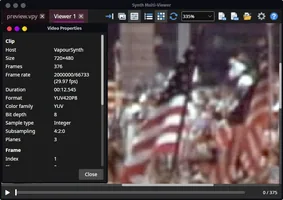
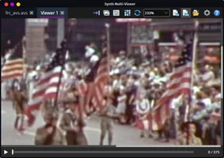
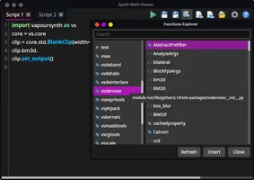
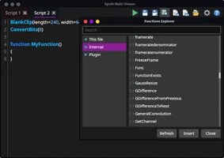
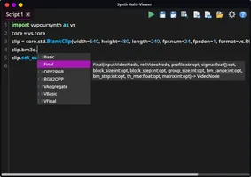
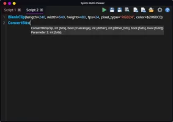

# Synth Multi-Viewer

**Cross-platform editor and viewer for VapourSynth and AviSynth**

With advanced script editing support, viewer zooming and panning support across tabs.

For VapourSynth/AviSynth, Windows/Linux/MacOS, x64/x86/ARM64.

The app is fully self-contained with no dependency.

### Features

- Auto-detect VS/AVS library and plugin locations, or customize locations
- ScriptAssist for autocomplete, call insight, and hover hints, for both VS/AVS
- Functions Explorer of everything available on the system, for both VS/AVS
- Code highlight for VS/AVS
- Edit multiple scripts with tabs
- Run multiple previews at once
- Zoom and pan to look at details
- Frame navigation, zoom and pan are shared between preview tabs
- Rename each tab for reference
- Full-screen preview
- Copy frame to clipboard
- Video properties window
- Light/Dark theme

### Screenshots

| | |
|---|---|
|  |  |
|  |  |
|  |  |

### Windows Installation

Run the setup. Make sure you download the x86 or x64 version depending on the version of AviSynth or VapourSynth you want to run. 

### Linux Installation

Download the AppImage and run it directly.

Optionally, you can use [AppImageLauncher](https://github.com/TheAssassin/AppImageLauncher) to install the app on first run.

On arch-based distros, you can install from AUR: `synthmultiviewer-appimage`

### MacOS Installation

Download and extract the ZIP file to place `SynthMultiViewer.app` into `/Applications`.

The first launch is blocked by Gatekeeper because the build is not notarized. Clear the quarantine flag, including files inside the bundle:

    xattr -dr com.apple.quarantine /Applications/SynthMultiViewer.app

Then open the app from Applications. If macOS still refuses, Control-click the app and choose Open.

VapourSynth and AviSynth must match that architecture. On Apple Silicon, Homebrew installs are ARM64, so use the ARM64 app.

### VapourSynth / AviSynth API for .NET

This repo also contains .NET API wrapper for [VapourSynth](ApiVapourSynth/) and [AviSynth](ApiAviSynth/).

### ScriptAssist

[ScriptAssist](ScriptAssist/README.md) provides completion, call insight, and hover for VapourSynth and AviSynth, with AvaloniaEdit and headless APIs. It analyzes text and supplied catalogs without executing scripts or requiring Python.

### License

[MIT License](LICENSE.md)

### Author

[Etienne Charland](https://www.hanumaninstitute.com) — Soul Architect | Reality Engineering | Coherence programming

### TODO

- Encode
- Pipette — YUV/RGB under the cursor
- Masks
- Plane view — Y / U / V (or RGB) as a display mode
- VS Output view